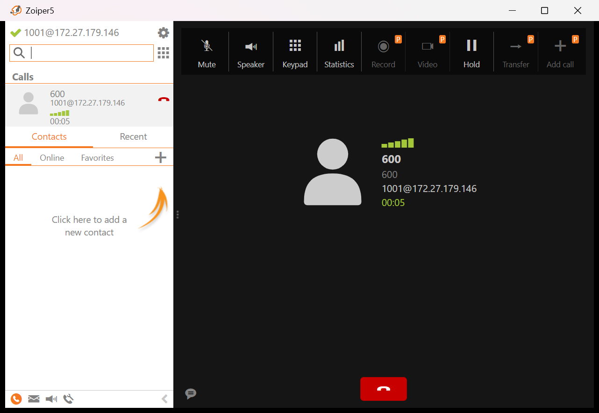

A phone switchboard that answers in Vietnamese but no need for GPU and cloud service to use, only CPU and RAM.

(​I use a bank assistant as an example, but you can customize it for any use case. Also I use low-end laptop to run this.)

```
Zoiper --SIP--> Asterisk (Docker) --AudioSocket TCP--> switchboard.py
                     ^                                   |-- gipformer        hear
                     |                                   |-- Gemma-4-E2B      understand (llama.cpp on Windows, CPU)
                     +------- AMI redirect to 1002 ------|-- Piper Cake       speak
```

## Demo



https://github.com/user-attachments/assets/eff0362e-6530-438b-a0b8-af9bb8bede9f

The recording is from the older build (Qwen3-4B on the iGPU, VieNeu voice), so the voice and timing there are not the current ones.

## What it does

- Answers 19 topics (interest rates, fees, opening hours, lost card...) from `app/docs/topics.json`. Each topic has three phrasings and the same sentence is never said twice in a row.
- Reads a balance, the last transaction or the daily limit, and locks a card, once the caller keys in a phone number and `#`. Locking asks for a yes first.
- Key menu: 1 balance, 2 last transaction, 3 limit, 4 lock card, 0 staff, 9 reads the menu. `#` while it is talking cuts the reply short.
- Transfers to extension 1002 when the caller asks for a person, says the answer is wrong twice in a row, or presses 0.
- After 8 s of silence it asks if the caller is still there, then says goodbye and hangs up.
- One call at a time. A second caller hears a hold notice and is connected when the line frees.
- Every call is written to `app/calls/*.jsonl` with the time each stage took.

The model only decides when the rules cannot: a question with a clear topic keyword, a yes/no to a confirmation, a key press or a goodbye never reaches it.

## Models and licenses

| | | License |
|---|---|---|
| Switchboard | Asterisk 23.4.1 (Docker) | GPLv2 |
| Hear | [gipformer1.5-68M-rnnt](https://huggingface.co/g-group-ai-lab/gipformer1.5-68M-rnnt) through sherpa-onnx | MIT, sherpa-onnx Apache 2.0 |
| Understand | [gemma-4-E2B-it Q4_0](https://huggingface.co/ggml-org/gemma-4-E2B-it-GGUF) on llama.cpp b11212 | Apache 2.0, llama.cpp MIT |
| Speak | [Piper Cake vi_VN](https://huggingface.co/CakeByVPBank/piper-pgl-v4-vi_VN-version39_epoch39), speaker 0, through piper-tts 1.8 | MIT, piper-tts GPL-3.0 |
| Voice activity, resampling | webrtcvad-wheels, soxr | MIT, LGPL-2.1 |

piper-tts is GPL-3.0, so a copy of this project that ships it falls under GPL-3.0 too.

## Running

Windows 11 with WSL (Ubuntu) and Docker. The model runs as a Windows program because Intel ships no Vulkan driver inside WSL, and the Windows firewall blocks WSL from calling out to Windows, so `app/llm_bridge.py` opens the connection from the Windows side instead.

```bash
python3 -m venv .venv && .venv/bin/python -m pip install -r requirements.txt
./get_models.sh
```

`get_models.sh` puts gipformer in `~/gipformer`, the Piper voice in `~/piper/cake`, and Gemma plus llama.cpp in `%USERPROFILE%\llamacpp`. Then double-click `Start switchboard.bat` (or `bash run.sh` inside WSL). It starts Asterisk, the model and the switchboard, and stops all of them on Ctrl+C. Port 8080 has to be free.

I also set `processors=6` in `%USERPROFILE%\.wslconfig`, which leaves two threads to Windows so the screen does not stutter while the model is thinking.

Register a softphone as `1001` (the passwords are in `asterisk/config/pjsip.conf`) and dial:

**600**: the switchboard.
**200**: echoes the caller back.
**900**: dials a person on 1002.

A second softphone on `1002` receives the transfers.

## Numbers

Measured on 28/09 on an i7-1185G7 (4 cores, no graphics card, 32 GB), with `tests/replay_calls.py` playing the eight calls right after a fresh start and `tests/latency_report.py` reading the call logs. The caller voice is Piper speaker 1. 18 spoken turns, 2 of them with a sentence the switchboard had already said.

| Stage | p50 | p95 |
|---|---|---|
| wait for the caller to stop | 0.80 s | 0.80 s |
| hear | 0.08 s | 0.09 s |
| understand | 0.02 s | 1.26 s |
| speak | 0.49 s | 0.72 s |
| caller stops -> reply starts | 1.48 s | 2.22 s |

The slowest turn was 2.42 s. The p95 comes from turns that reach the model; the rest are answered by the rules. Under load the laptop throttles to about 54% of its clock.

During a call the switchboard uses 0.3 of a core on average (1.8 at peak) and about 500 MB, llama-server 2.6 GB with peaks of 3 to 4 cores while it answers.

Two calls at once took up to 15 s per turn: llama-server has one slot, and the two conversations keep pushing each other's prompt out of the cache. That is why it holds the second caller instead.

## Tests

```bash
.venv/bin/python -m pytest
```

121 tests. The two in `tests/test_model_battery.py` ask the running model 26 questions and skip when it is not up. With the switchboard running:

- `tests/replay_calls.py` plays eight calls (card lock yes and no, key menu, documents, a caller who will not dial, silence, `#`, a second caller on hold) and checks each reply by transcribing it.
- `tests/measure_load.py` does the same while sampling CPU and RAM.
- `tests/score_recordings.py` scores a real test run: start with `TONGDAI_RECORD=1 bash run.sh`, read the 122 lines of `tests/cau-thu.tsv` into Zoiper one per turn, then run it with `--since` set to the time of the first call. It prints the word error rate and how many were understood.
