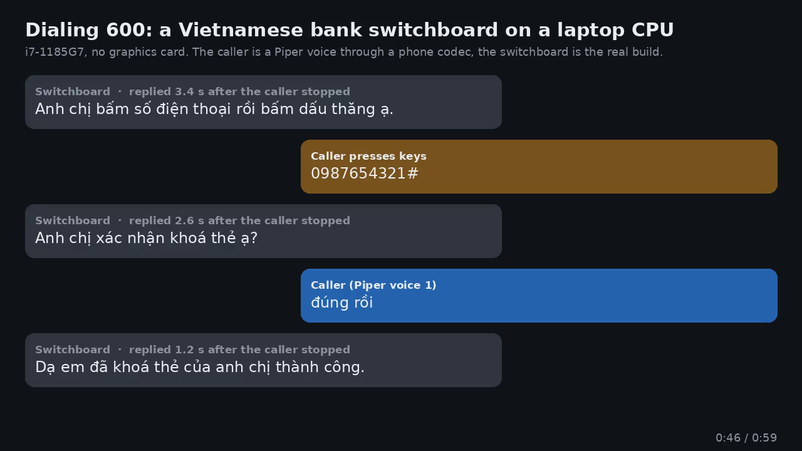

A phone switchboard that answers callers in Vietnamese, running on a laptop CPU.

[](docs/demo-call.mp3)

https://github.com/user-attachments/assets/5f15ed79-c462-433b-a1b7-56af63bedd98

## Highlights

- No GPU, no cloud: everything runs locally on an i7 laptop.
- Replies about 1.5 s after the caller stops talking.
- Looks up accounts after the caller keys in a number, and asks before changing anything.
- Transfers to a real person on extension 1002 when it cannot help.
- Swap the bank for any other business by editing `app/domain/`.

## How it works

- Asterisk takes the call and streams audio over AudioSocket.
- gipformer turns speech into text.
- Rules answer most turns; Gemma-4-E2B on llama.cpp handles the rest.
- Piper speaks the reply.

## Running

Built on Windows 11 with WSL and Docker.

```bash
python3 -m venv .venv && .venv/bin/python -m pip install -r requirements.txt
./get_models.sh
bash run.sh
```

- Call with Zoiper 5: register it as 1001 (password in `asterisk/config/pjsip.conf`) and dial 600.
- `pytest` runs the tests; the ones that need the model skip when it is not running.

## License

- Asterisk: GPLv2
- gipformer, Piper Cake voice, llama.cpp: MIT
- Gemma 4: Apache 2.0
- piper-tts: GPL-3.0
